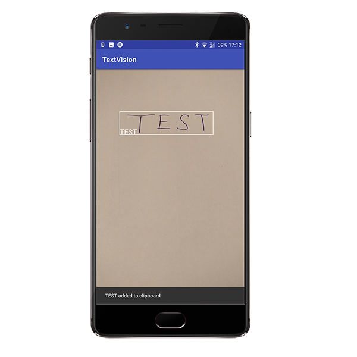

# TextVision
Android application which recognizes written text and pastes it into the clipboard.  
Just point your phone at the text you want to recognise and let TextVision do the rest!  
This application can be found [in the Google Play Store](https://play.google.com/store/apps/details?id=nl.vosdevelopment.textvision).

TextVision interface                                                            
:--------------------------------------------------------:

# Building this application
No special libraries other than the Google OCR library are required to build this application.
The Google OCR library will be downloaded automatically on first use.
Some fail-safe code is used to make sure the application has the required library before trying to process the frames.

# Source
This application has been built with the Google OCR reader sample application as a foundation, which in turn utilizes the Google Vision API.
Sourcecode for that application can be found [here](https://github.com/googlesamples/android-vision/tree/master/visionSamples/ocr-reader)
